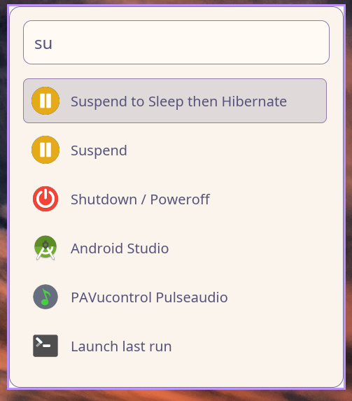

import { Aside, Tabs, TabItem, Card, CardGrid } from '@astrojs/starlight/components';

The native interface supports dark and light themes with full color customization.

<Aside type="note">
Themes are only available in **native mode**. Fuzzel mode uses system Fuzzel configuration.
</Aside>

## Built-in Themes

Raffi comes with two built-in themes:

<CardGrid>
  <Card title="Dark Theme" icon="moon">
    Dracula-inspired dark palette (default)
  </Card>
  <Card title="Light Theme" icon="sun">
    Rose Pine Dawn light palette
  </Card>
</CardGrid>

## Selecting a Theme

### Command Line

<Tabs>
<TabItem label="Dark Theme (Default)">
```bash
raffi -u native -t dark
```
</TabItem>
<TabItem label="Light Theme">
```bash
raffi -u native -t light
```
</TabItem>
</Tabs>

### Configuration File

```yaml raffi.yaml
general:
  theme: dark  # or "light"
```

<Tabs>
  <TabItem label="Dark Theme">
    ```yaml
    general:
      ui_type: native
      theme: dark
    ```

    Dracula-inspired dark palette with high contrast
  </TabItem>
  
  <TabItem label="Light Theme">
    ```yaml
    general:
      ui_type: native
      theme: light
    ```

    
  </TabItem>
</Tabs>

## Custom Colors

Individual theme colors can be customized under `theme_colors`. Only the colors you specify are overridden; the rest come from the base theme.

### Available Color Keys

**`bg_base`** `string`

Main background color


**`bg_input`** `string`

Search input background color


**`accent`** `string`

Primary accent color (highlights, active items)


**`accent_hover`** `string`

Accent color on hover


**`text_main`** `string`

Primary text color


**`text_muted`** `string`

Secondary/muted text color


**`selection_bg`** `string`

Selected item background


**`border`** `string`

Border and separator colors


### Color Format

Colors accept hex color strings in these formats:

- `#RGB` - Short form (e.g., `#f0f`)
- `#RRGGBB` - Standard form (e.g., `#ff00ff`)
- `#RRGGBBAA` - With alpha channel (e.g., `#ff00ff80`)

## Custom Color Examples

### Catppuccin Mocha

```yaml raffi.yaml
general:
  theme: dark
  theme_colors:
    bg_base: "#1e1e2e"
    bg_input: "#313244"
    accent: "#cba6f7"
    accent_hover: "#89b4fa"
    text_main: "#cdd6f4"
    text_muted: "#6c7086"
    selection_bg: "#45475a"
    border: "#585b70"
```

### Nord

```yaml raffi.yaml
general:
  theme: dark
  theme_colors:
    bg_base: "#2e3440"
    bg_input: "#3b4252"
    accent: "#88c0d0"
    accent_hover: "#81a1c1"
    text_main: "#eceff4"
    text_muted: "#d8dee9"
    selection_bg: "#434c5e"
    border: "#4c566a"
```

### Gruvbox Dark

```yaml raffi.yaml
general:
  theme: dark
  theme_colors:
    bg_base: "#282828"
    bg_input: "#3c3836"
    accent: "#d79921"
    accent_hover: "#fabd2f"
    text_main: "#ebdbb2"
    text_muted: "#a89984"
    selection_bg: "#504945"
    border: "#665c54"
```

### Solarized Light

```yaml raffi.yaml
general:
  theme: light
  theme_colors:
    bg_base: "#fdf6e3"
    bg_input: "#eee8d5"
    accent: "#268bd2"
    accent_hover: "#2aa198"
    text_main: "#657b83"
    text_muted: "#93a1a1"
    selection_bg: "#eee8d5"
    border: "#93a1a1"
```

### Tokyo Night

```yaml raffi.yaml
general:
  theme: dark
  theme_colors:
    bg_base: "#1a1b26"
    bg_input: "#24283b"
    accent: "#7aa2f7"
    accent_hover: "#bb9af7"
    text_main: "#c0caf5"
    text_muted: "#565f89"
    selection_bg: "#292e42"
    border: "#414868"
```

## Partial Color Override

You can override just a few colors while keeping the rest from the base theme:

```yaml raffi.yaml
general:
  theme: dark
  theme_colors:
    accent: "#ff6b9d"  # Custom pink accent
    # All other colors use dark theme defaults
```

## Font Customization

Combine theme customization with font settings:

```yaml raffi.yaml
general:
  ui_type: native
  theme: dark
  theme_colors:
    accent: "#cba6f7"
  font_family: "Inter"
  font_size: 20
  window_width: 900
  window_height: 500
```

### Font Settings

**`font_family`** `string`

Font family name (e.g., "Inter", "Fira Sans"). System default sans-serif when omitted.


**`font_size`** `number` (default: `20`)

Base font size in pixels. Other UI sizes scale proportionally:
  - Input text: 1.2× base
  - Subtitles: 0.7× base
  - Hints: 0.6× base


**`window_width`** `number` (default: `800`)

Window width in pixels


**`window_height`** `number` (default: `600`)

Window height in pixels


**`padding`** `number`

Outer window padding in pixels. Scales with font_size if not set.


## Complete Theme Configuration

<Tabs>
<TabItem label="Dark + Catppuccin">
```yaml
general:
  ui_type: native
  theme: dark
  theme_colors:
    bg_base: "#1e1e2e"
    bg_input: "#313244"
    accent: "#cba6f7"
    accent_hover: "#89b4fa"
    text_main: "#cdd6f4"
    text_muted: "#6c7086"
    selection_bg: "#45475a"
    border: "#585b70"
  font_family: "Inter"
  font_size: 20
  window_width: 900
  window_height: 500
```
</TabItem>
<TabItem label="Light + Custom">
```yaml
general:
  ui_type: native
  theme: light
  theme_colors:
    accent: "#0066cc"
    accent_hover: "#0052a3"
  font_family: "Fira Sans"
  font_size: 18
  window_width: 800
  window_height: 600
```
</TabItem>
</Tabs>

## Theme Previews


  <details>
<summary>Default Dark Theme</summary>

    Dracula-inspired palette with:
    - Deep purple background
    - High contrast text
    - Purple/pink accents
    - Excellent readability
  </details>

  <details>
<summary>Default Light Theme</summary>

    Rose Pine Dawn palette with:
    - Soft, warm background
    - Comfortable contrast
    - Muted accents
    - Eye-friendly for bright environments
  </details>

  <details>
<summary>Custom Themes</summary>

    Create your own by:
    1. Starting with a base theme (dark or light)
    2. Overriding specific colors
    3. Testing with `raffi -u native -t [theme]`
    4. Adjusting until satisfied
  </details>


## Tips

<Aside type="tip">
Start with a base theme and override only the colors you want to change
</Aside>

<Aside type="tip">
Use consistent color schemes across your system for a cohesive experience
</Aside>

<Aside type="tip">
Test your custom colors in both bright and dim lighting conditions
</Aside>

<Aside type="tip">
Consider accessibility: maintain sufficient contrast between text and background
</Aside>

## Color Palette Generators

Generate custom palettes using these tools:

- [Catppuccin](https://github.com/catppuccin/catppuccin)
- [Nord](https://www.nordtheme.com/)
- [Gruvbox](https://github.com/morhetz/gruvbox)
- [Tokyo Night](https://github.com/enkia/tokyo-night-vscode-theme)
- [Dracula](https://draculatheme.com/)
- [Rose Pine](https://rosepinetheme.com/)

## Troubleshooting


  <details>
<summary>Colors not applying</summary>

    1. Ensure you're using native mode: `ui_type: native`
    2. Check color format: `#RRGGBB` or `#RGB`
    3. Verify YAML syntax (proper indentation)
    4. Restart Raffi after config changes
  </details>

  <details>
<summary>Font not changing</summary>

    1. Make sure font is installed on your system
    2. Use exact font name (case-sensitive)
    3. Try `fc-list` to see available fonts
    4. Set `font_family: "Font Name"` in quotes
  </details>

  <details>
<summary>Poor contrast</summary>

    Adjust these color pairs for better readability:
    - `text_main` vs `bg_base`
    - `text_main` vs `selection_bg`
    - `accent` vs `bg_base`
  </details>

