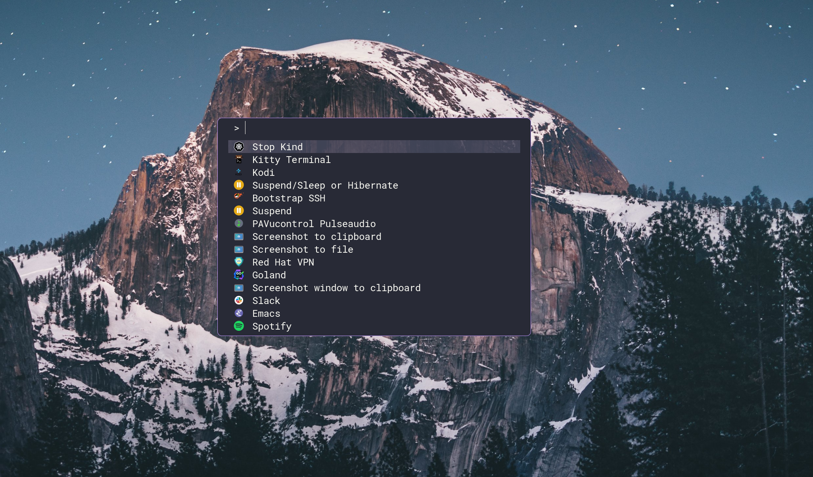

import { Aside, Card, CardGrid } from '@astrojs/starlight/components';

Raffi is a flexible application launcher designed for Wayland environments that lets you define commands, scripts, and workflows in a simple YAML configuration file.



## What is Raffi?

Raffi is an application launcher that sits on top of Fuzzel or operates using its own built-in native interface. It provides a powerful way to launch applications, run scripts, and execute commands with support for:

- **YAML-based configuration** - Define all your commands and workflows in a simple, readable format
- **Icon support** - Visual application identification with cached icon paths
- **Script execution** - Run inline scripts with configurable interpreters (Bash, Python, etc.)
- **Conditional visibility** - Show/hide entries based on environment variables or binary availability
- **Multiple UI modes** - Use external Fuzzel or the built-in native interface

## Key Features

<CardGrid>
  <Card title="Dual Interface Modes" icon="display">
    Choose between Fuzzel integration for a minimal Wayland-native experience or the built-in iced-based GUI with fuzzy search and theming.
  </Card>
  
  <Card title="YAML Configuration" icon="file-code">
    Define applications, scripts, and commands in `~/.config/raffi/raffi.yaml` with support for arguments, icons, and conditional display.
  </Card>
  
  <Card title="Native Interface Addons" icon="puzzle-piece">
    Built-in calculator, currency converter, file browser, web searches, text snippets, and script filters for extended functionality.
  </Card>
  
  <Card title="Script Support" icon="terminal">
    Execute inline scripts with any interpreter (Bash, Python, Node.js) directly from the launcher with environment variable expansion.
  </Card>
</CardGrid>

## Native Interface Addons

When using the native UI mode (`-u native`), Raffi includes several powerful addons:

### Calculator

Evaluate mathematical expressions as you type with support for standard operators and functions like `sqrt`, `sin`, `cos`, `log`, and more. Results can be copied to clipboard with Enter.

```
2 + 2 * 5
sqrt(144)
sin(90) * cos(45)
```

### Currency Converter

Convert between currencies with real-time exchange rates from the Frankfurter API (cached for one hour).

```
$10 to eur
$50 gbp to usd
$100eur to jpy
```

### File Browser

Navigate your filesystem directly in the launcher. Type `/` for root or `~` for home directory. Select files to open with `xdg-open`, or use Alt+Enter to copy the path.

### Script Filters

Extend Raffi with dynamic results from external commands using the Alfred Script Filter JSON format. Perfect for custom workflows like PR browsers, password managers, or any data source.

### Web Searches

Quick web searches via URL templates. Type a keyword followed by your query to search Google, DuckDuckGo, GitHub, Wikipedia, and more.

```
g rust async traits
gh user/repo
wiki wayland
```

### Text Snippets

Store and quickly insert reusable text snippets from inline config, YAML files, directories, or command output.

## Use Cases


  <details>
<summary>Application Launcher</summary>

    Launch applications with custom arguments and environment variables. Define entries only for binaries that exist in your PATH.

    ```yaml
    firefox:
      binary: firefox
      args: [--marionette]
      icon: firefox
      description: Firefox browser with marionette enabled
    ```
  </details>
  
  <details>
<summary>Script Execution</summary>

    Run inline scripts with any interpreter directly from the launcher.

    ```yaml
    hello_python:
      binary: python3
      script: |
        import os
        print("Hello from Python!")
        print(os.environ)
      description: "Hello Python script"
      icon: "script"
    ```
  </details>
  
  <details>
<summary>Conditional Workflows</summary>

    Show entries only when specific conditions are met.

    ```yaml
    gnome_app:
      binary: gnome-tweaks
      description: GNOME Tweaks
      ifenveq: [DESKTOP_SESSION, GNOME]
    ```
  </details>
  
  <details>
<summary>Window Manager Integration</summary>

    Integrate with Sway, Hyprland, or other Wayland compositors for seamless launching.

    ```ini
    # Sway
    bindsym $super+Space exec raffi -p | xargs swaymsg exec --
    
    # Hyprland
    bind = $super, R, exec, (val=$(raffi -pI); echo $val | grep -q . && hyprctl dispatch exec "$val")
    ```
  </details>


## Why Raffi?

- **Lightweight** - 1.1 MB binary when built without native UI, ~15 MB with GUI support
- **Flexible** - Works with Fuzzel or standalone with built-in interface
- **Extensible** - Script filters and addons for custom workflows
- **Wayland-first** - Designed specifically for modern Wayland compositors
- **Simple configuration** - Human-readable YAML with path expansion and environment variables

<Aside type="note">
  If you only need Fuzzel integration, build without default features to get a significantly smaller binary: `cargo build --release --no-default-features`
</Aside>

## Next Steps

<CardGrid>
  <Card title="Install Raffi" icon="download">
    Get started with installation via cargo, AUR, Homebrew, or build from source
  </Card>
  
  <Card title="Quick Start" icon="rocket">
    Configure and launch your first application with Raffi
  </Card>
</CardGrid>
